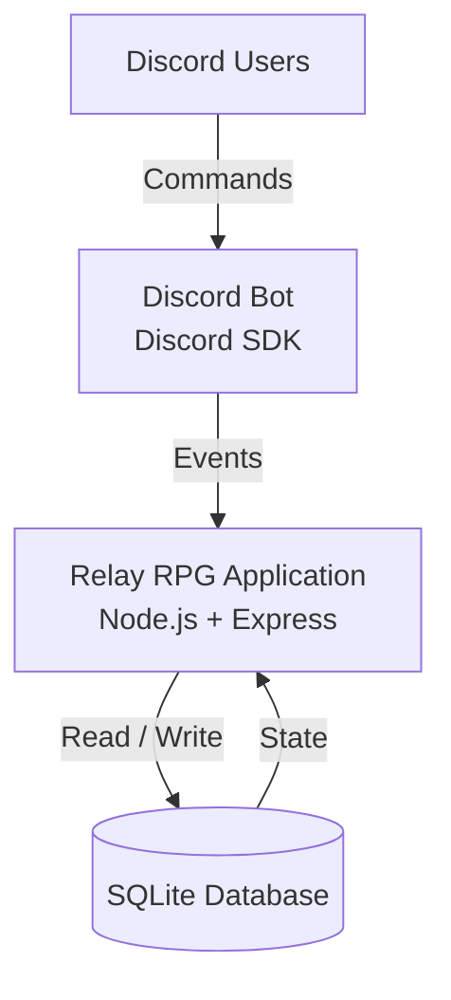
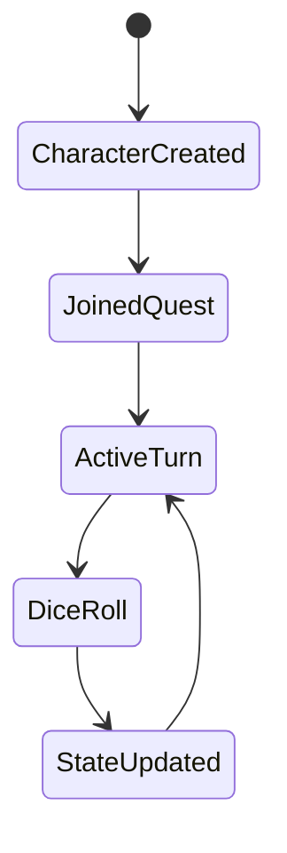

# Relay RPG — System Design Overview

Relay RPG is an event-driven Discord RPG system where players collaboratively create and progress persistent characters through turn-based storytelling and dice-based mechanics.

The core challenge of the system is managing shared, evolving game state across multiple users and Discord servers while keeping interactions simple and stateless at the interface level.

---

## System Goals

- Maintain persistent character and game state across sessions
- Support turn-based, multi-user progression without race conditions
- Keep Discord interactions stateless and command-driven
- Ensure all game logic is server-authoritative

---

## High-Level Architecture

Relay RPG is built around a simple principle:

> Discord acts as an input layer — the server is the system of record.

### Core components:

- **Discord Bot Layer**
  - Receives user commands (`create character`, `join quest`, `roll`, etc.)
  - Translates interactions into structured events

- **Application Layer (Node.js + Express)**
  - Handles game rules and turn progression
  - Validates actions and enforces game state transitions
  - Acts as the authoritative system of logic

- **Persistence Layer (SQLite)**
  - Stores:
    - Player profiles
    - Character state
    - Active quests
    - Turn progression state
  - Ensures continuity across sessions and restarts

---

## State Model

At the core of the system is a persistent state model:

- **Player → owns multiple Characters**
- **Character → participates in Quests**
- **Quest → contains turn-based progression state**
- **Turn State → determines valid next actions**

All mutations flow through controlled server-side transitions.

---

## Command Flow

A typical interaction follows this pipeline:

1. User issues a Discord command
2. Bot parses input into a structured action
3. Server validates action against current state
4. Game logic updates persistent state (SQLite)
5. Response is generated and sent back to Discord

This ensures:
- no client-side trust
- deterministic state transitions
- consistent multi-user behavior

---

## Key Design Decisions

### 1. Server-authoritative game logic
All rules and validations live on the server to prevent desync between users.

### 2. Stateless interface layer (Discord)
Discord is treated purely as an input/output channel, not a source of truth.

### 3. Persistent turn-based state machine
Game progression is modeled as a state machine rather than ad-hoc logic.

### 4. Simple persistence layer (SQLite)
Chosen to keep state local, reliable, and easy to reason about for a single-node deployment.

---

## Why this project matters

Relay RPG demonstrates:

- event-driven system design
- persistent shared state management
- command-based architecture
- multi-user concurrency handling (logical, not thread-based)
- real-world state machine modeling

---

## Summary

Relay RPG is a small but complete example of a server-authoritative, event-driven system where all game state is modeled, validated, and persisted on the backend — with Discord serving purely as an interaction layer.
